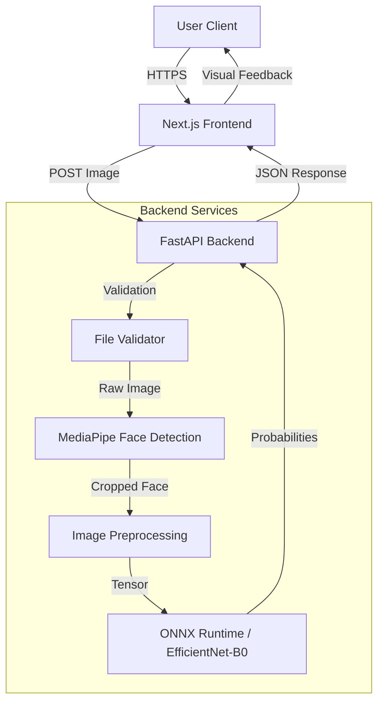
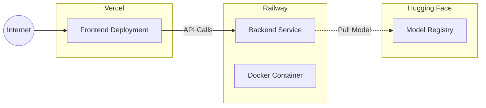

# System Architecture

## Overview
The Emotion Detection Web App uses a modern decoupled architecture with a Next.js frontend and a FastAPI backend. The system is designed for stateless, privacy-first processing where images are analyzed in real-time without persistent storage.

## High-Level Architecture

## Data Flow Pipeline

The data processing pipeline ensures images are handled securely and efficiently:

1. **Upload**: User uploads an image via the React-based drag-and-drop interface.
2. **Client Validation**: Frontend checks file type and size limits before upload.
3. **Transmission**: Image uploaded securely to Backend API.
4. **Server Validation**: Backend verifies magic bytes and file integrity.
5. **Face Detection**: MediaPipe detects face landmarks; closest face is cropped.
6. **Inference**: Cropped face is normalized and passed to the ONNX model.
7. **Cleanup**: Image data is cleared from memory; temp files are deleted immediately.
8. **Response**: Prediction results returned to client.

## Deployment Architecture

## Technology Choices

| Component | Technology | Rationale |
|-----------|------------|-----------|
| **Frontend** | Next.js 14 | Server-side rendering, easy Vercel deployment, React ecosystem. |
| **Backend** | FastAPI | High performance, native async support, easy Swagger docs. |
| **Model** | ONNX Runtime | Framework-agnostic, optimized for CPU inference (cost-effective). |
| **Container** | Docker | Consistent environment, simplifies deployment on Railway. |

